<!--
  ╔═══════════════════════════════════════════════════════════════╗
  ║   Muhammad Usman  ·  Data Science  ·  github/dominator959   ║
  ╚═══════════════════════════════════════════════════════════════╝
-->

<div align="center">



</div>

---

<br>

```
$ whoami
```

> A data science student who believes the most dangerous thing you can do
> with data is present it without understanding it.
>
> I build systems that turn noise into signal —
> currently in the part of the story where the protagonist is still training.

<br>

---

<br>

```
$ cat /etc/philosophy
```

```
Most people treat data science as a toolbox.
I treat it as a lens.

The goal isn't to run models.
The goal is to ask the question no one thought to ask —
then answer it rigorously.

Automation is not laziness. It is respect for your own attention.
A dashboard is not a deliverable. It is a conversation.
Code that works is the floor, not the ceiling.
```

<br>

---

<br>

```
$ ls -la ./stack/
```

| Layer | Tools |
|---|---|
| **Language** | Python · C++ · SQL |
| **Data** | Pandas · NumPy · Scikit-learn |
| **Viz** | Matplotlib · Seaborn · Power BI |
| **Infra** | Git · Linux · Jupyter · VS Code |
| **Automation** | n8n · Playwright · Selenium |
| **Learning** | MLflow · FastAPI · Streamlit `[ in progress ]` |

<br>

---

<br>

```
$ cat ./now.log
```

```
[STATUS]  Building in public — slowly, deliberately, without shortcuts.
[FOCUS]   End-to-end ML pipelines · EDA that actually tells a story
[REGION]  Pakistan · Local data. Global methods.
[NOTE]    Most repos are private — being rebuilt to a higher standard.
          They'll return when they deserve to be seen.
```

<br>

---

<br>

```
$ grep -r "signal" ./values/
```

> **Precision over speed.**
> A model that explains itself is worth more than one that doesn't.

> **Context is everything.**
> The same number means different things in different datasets.
> I try to never forget that.

> **Ship when it's ready.**
> Not when it's done — when it's ready.
> There's a difference.

<br>

---

<br>

```
$ ping ./reach-me
```

<div align="center">

[](https://www.linkedin.com/in/muhammad-usman-157841269/)
&nbsp;
[](https://twitter.com/cars_pk)

</div>

<br>

---

<br>

<div align="center">

```
╔──────────────────────────────────────────────────────────╗
│                                                          │
│   "Not yet finished. Never actually done."               │
│                                                          │
╚──────────────────────────────────────────────────────────╝
```

`Pakistan · 2025 → ∞`

</div>
